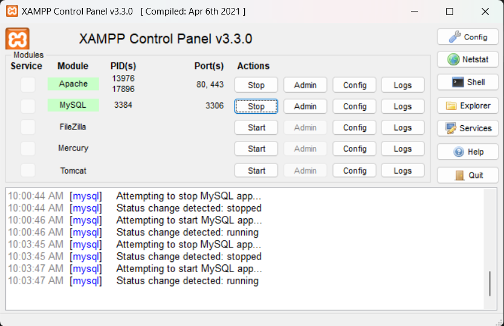
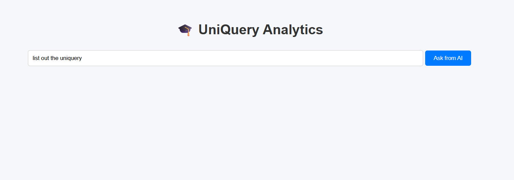
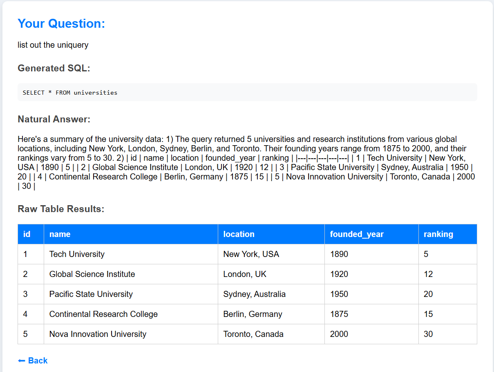

# 🎓 UniQuery AI Chatbot

UniQuery is an **AI-powered web chatbot** that converts **natural language questions** into **SQL queries**, executes them on a MySQL database, and returns results with clear explanations.  
It combines **Flask, MySQL, and Google Gemini API** to make databases accessible through plain English.

---

## 🚀 Features
- 🤖 Ask questions in plain English  
- 📝 AI converts them into **safe SQL queries**  
- 🗄️ Queries run against a **MySQL database**  
- 📊 Returns both **raw results** and a **natural language summary**  
- 🌐 Clean and simple **web interface**  

---

## 🛠️ Tech Stack
- **Python (Flask)** – Web framework  
- **MySQL** – Database  
- **Google Gemini API** – Natural language to SQL + summarization  
- **SQLParse** – SQL validation  
- **dotenv** – Manage environment variables  

---

## 📂 Project Structure
```
UniQuery.py                # Main Flask app
requirements.txt           # Python dependencies
schema_and_sample_data.sql # Database schema + sample data
templates/
   └── index.html          # Web frontend
   └── results.html
.env.example               # Environment variable template
```

---

## ⚙️ Setup Instructions

### 1. Clone the Repository
```bash
git clone https://github.com/zaaraziof0/UniQuery-AI-Chatbot.git
cd UniQuery-AI-Chatbot
```

### 2. Create Virtual Environment
```bash
python -m venv venv
# Activate:
venv\Scripts\activate      # Windows
source venv/bin/activate   # Linux/Mac
```

### 3. Install Dependencies
```bash
pip install -r requirements.txt
```

### 4. Setup MySQL Database
```bash
mysql -u root -p < schema_and_sample_data.sql
```

### 5. Configure Environment Variables
Copy `.env.example` → `.env` and fill in values:
```ini
MYSQL_HOST=127.0.0.1
MYSQL_PORT=3306
MYSQL_USER=root
MYSQL_PASSWORD=yourpassword
MYSQL_DB=uniquery
GEMINI_API_KEY=your_gemini_api_key
FLASK_SECRET_KEY=supersecretkey
```

### 6. Run the Xampp


### 7. Run the Application
```bash
python UniQuery.py
```

### 8. Open in Browser
```
http://127.0.0.1:5000
```

---

## 📸 Demo
**User asking a question:**



**AI giving an answer:**



---

## 🙌 Contributing
Contributions are welcome!  
Please fork this repo, make changes in a new branch, and submit a pull request.

---

## 📜 License
This project is licensed under the **MIT License** – feel free to use, modify, and share.

---

## 💡 Acknowledgements
- [Flask](https://flask.palletsprojects.com/)  
- [Google Gemini API](https://ai.google.dev/)  
- [MySQL](https://www.mysql.com/)  
